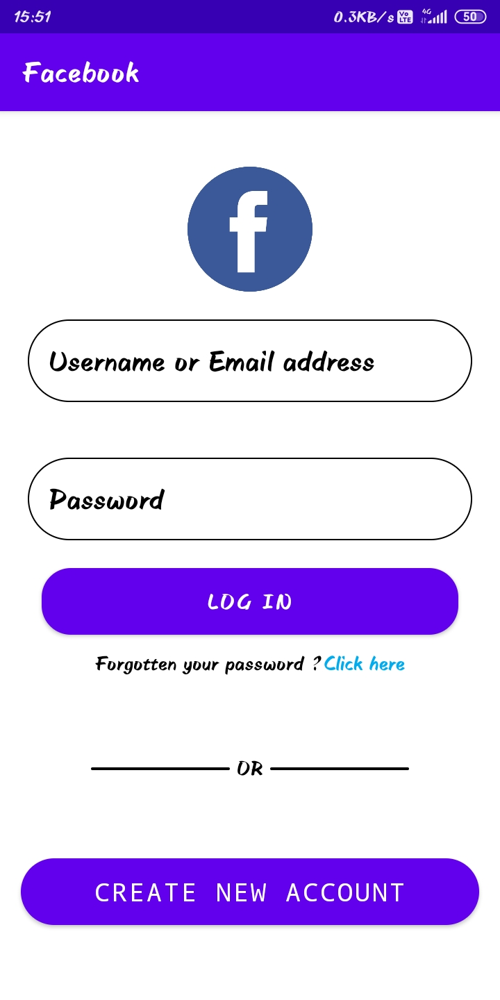
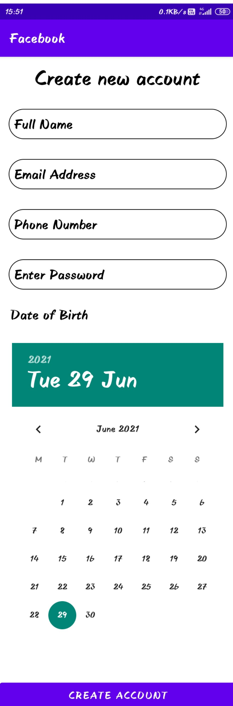

# Facebook App

## Table of contents

- [Overview](#Overview)
  - [Screenshot](#Screenshot)
  - [Requirements](#Requirements)
  - [Credentials used](#Credentials-used)
  - [Built with](#Built-with)
- [Author](#author)

## Overview
 -The project was to create a facebook login and signup page using XML and Java.

### Screenshot

### Requirements
 - Android version 9 and +.

### Credentials-used
 - To get the "Login Successfully" notification use the following login details:
    Username - JohnDoe
    Password - JohnDoe

### Built-with
 -XML (Frontend)
 -Java(Functionality)

### Author

- Website - [Varun Grover](https://thevarungrovers.vercel.app)
- GitHub - [@thevarungrovers](https://www.github.com/thevarungrovers)
- Codepen - [@thevarungrovers](https://www.codepen.io/thevarungrovers)